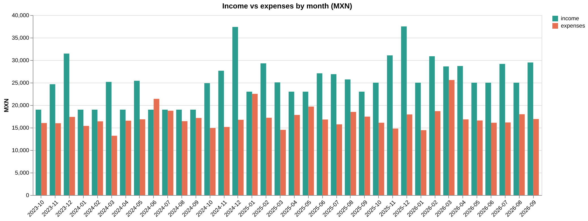
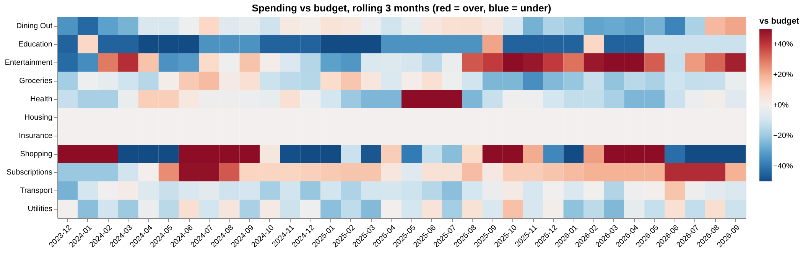
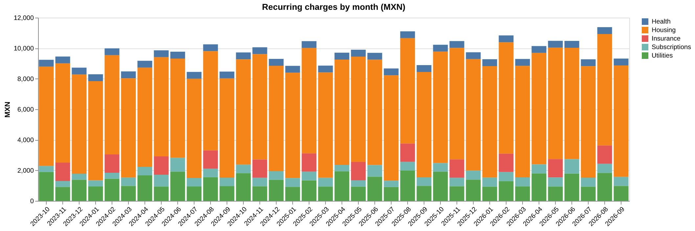
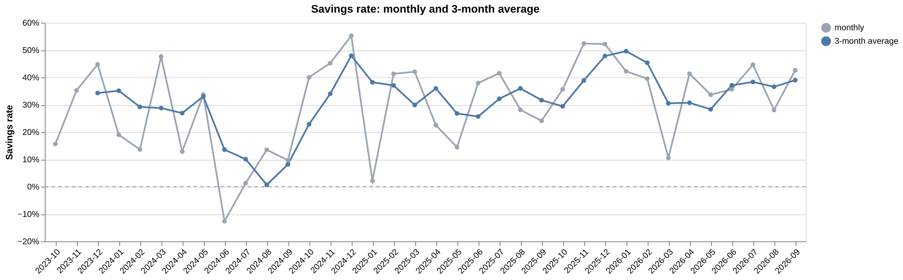
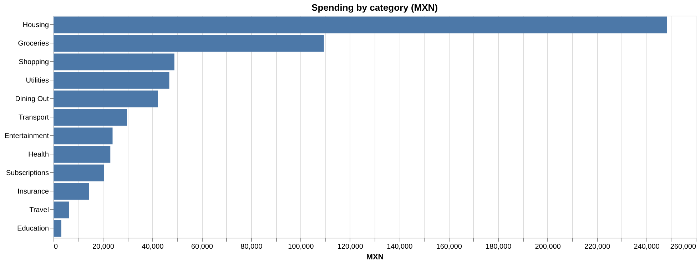

# SpendLens

Personal finance analytics, managed like cloud spend: see where the money goes, budget against it, catch creeping subscriptions and one-off surprises, and track what you invest. Local-first, CSV in, dashboard out.



## What it does

| Question | Answer |
|---|---|
| Am I saving enough? | Monthly cash flow and savings rate, with a 3-month average that smooths bonus months |
| Am I on budget? | Budget vs actual per category and month, with budgets that change over time |
| What am I locked into? | Recurring-charge detection with a monthly and yearly run rate |
| Did anything get more expensive? | Price-change alerts, each with its yearly cost |
| Was I charged twice? | Duplicate-charge detection |
| What was out of the ordinary? | Unusual transactions flagged with a robust z-score |
| How are my investments doing? | Positions from purchase lots, live prices, annualized return (XIRR) |

The dashboard has four tabs (Overview, Budget vs actual, Recurring & alerts, Portfolio) and a period filter (all time, last 12 months, last 6 months).

### Budget vs actual

Each cell compares the last 3 months of spending in a category with the last 3 months of its budget. A single month is available in the dashboard too, but lumpy costs such as a quarterly insurance premium swing from -100% to +200% against a flat monthly budget. A rolling window compares like with like.



### Recurring charges and alerts



On the sample data the detector finds 13 recurring charges (12 active) that make up 56% of all spending, and reports:

- Netflix 219 to 249 (+13.7%, +360 a year), Spotify 129 to 149 (+15.5%, +240 a year), rent up twice (+4,800 a year each)
- A duplicate Netflix charge in May 2024
- Four one-off expenses: flight tickets, dental emergency, phone replacement, laptop repair

### More charts

| | |
|---|---|
|  |  |

## Quick start

Tested on Python 3.13; should work on 3.10+.

```bash
git clone https://github.com/a-leon11/spendlens.git
cd spendlens
pip install -r requirements.txt
python -m streamlit run dashboard.py
```

| Command | What it does |
|---|---|
| `python budget_summary.py` | Monthly budget table and category totals in the terminal |
| `python investment_tracker.py` | Portfolio positions in the terminal |
| `python visualize_portfolio.py` | Saves an allocation chart to `output/` |
| `python -m spendlens.sample_data --force` | Regenerates the sample CSVs in `data/` |
| `python -m spendlens.figures` | Regenerates the README images from `data/` (needs `requirements-dev.txt`) |
| `pip install -r requirements-dev.txt` then `python -m pytest` | Installs test tools and runs the 39 tests |

## Data

The CSVs in `data/` are **synthetic**: 36 months (Oct 2023 to Sep 2026), 93 income rows, 1,092 expenses, 47 investment lots and 13 budget rows. Income and expenses are in MXN. Investment buy prices are in USD and are generated, not real market history.

**Use your own data:** put real CSVs in `data/private/`. That folder is gitignored and takes priority over `data/`, so your finances never reach the repo. You can also point `SPENDLENS_DATA_DIR` at any folder. The README images are always rendered from `data/`, never from `data/private/`.

Dates are `YYYY-MM-DD`.

| File | Columns | Required |
|---|---|---|
| `income.csv` | `date, source, amount, category` | yes |
| `expenses.csv` | `date, description, amount, category` | yes |
| `investments.csv` | `ticker, shares, buy_price, buy_date` (one row per purchase lot) | yes |
| `budgets.csv` | `category, monthly_budget, effective_from` | no |

`budgets.csv` can hold several rows per category. A month uses the latest budget whose `effective_from` is on or before the first day of that month, so a rent budget can step up in October without rewriting history. Without the file, the budget tab explains what to add and the rest of the dashboard works.

## How the analysis works

**Budget vs actual** (`budget.py`). Spending is totalled per month and category, then each month is joined to the budget in force that month (an as-of join on `effective_from`). Variance is actual minus budget, so positive means over. Spending in a category with no budget is shown as unbudgeted instead of being dropped. Rolling variance sums actual and budget over the window before dividing.

**Recurring charges** (`recurring.py`). A description counts as recurring when it has at least 3 billing months, the gaps between them are regular (at least 70% match the typical gap of 1, 2, 3, 6 or 12 months) and the billing day is stable (standard deviation of 3.5 days or less). That separates subscriptions and bills from things you buy often on random days, like groceries. Charges whose amount changes in most billings (utilities) are marked variable, get no price-change alerts, and are only accepted at monthly or two-monthly cadence, so a fluctuating once-a-year purchase such as holiday gifts is not mistaken for a bill. Price changes are month-to-month moves of more than 2% on fixed charges. A charge is active if it was billed within one cadence interval of the end of the data.

**Unusual transactions** (`anomalies.py`). Robust z-score, `0.6745 * (amount - median) / MAD`, where MAD is the median absolute deviation. Median and MAD barely move when an outlier is present, unlike mean and standard deviation, so a big purchase cannot hide itself by inflating the spread. Each transaction is compared with its own category when the category has at least 8 transactions, otherwise with all spending. A transaction is flagged when its score is at least 3.5 and it is at least 3 times the typical amount. Recurring charges are excluded.

**Portfolio return** (`returns.py`). XIRR solves for the annual rate that makes the present value of every purchase and the current value sum to zero, using actual dates (bisection, 365-day year). It is only shown when every holding has a live price. When a price is unavailable, that position is valued at cost basis and the dashboard says so, rather than showing a return built on a guess.

## Checking the detectors

The sample generator plants known patterns: four one-off expenses, a duplicate Netflix charge, two subscription price increases, two rent increases, a variable utility bill with a seasonal swing, and a yearly and a quarterly charge. The tests check that the detectors find them and nothing else. On the sample data the anomaly detector finds 4 of 4 planted one-offs with no false positives. Mutation checks (loosening the multiple rule, removing the seasonal handling) make the tests fail, so they are not passing by accident.

Honest caveats:

- The sample data is synthetic and was generated by the same project, so these results show the logic does what it says, not how it performs on real statements.
- Two thresholds were tuned after seeing the sample data. The minimum multiple was raised from 2.0 to 3.0 after an ordinary 496 café bill was flagged, and variable charges with a gap over 2 months are skipped after holiday gifts were read as a yearly bill. Both are documented in the code. Real data may need different values, and all of them are function arguments.
- Live prices come from yfinance and were not available while generating the images, so the allocation image is valued at cost.

## Project structure

```
spendlens/
├── data.py           # schema-checked CSV loaders
├── budget.py         # monthly summary, category breakdown, budget vs actual, rolling variance
├── recurring.py      # recurring charges, price changes, duplicates
├── anomalies.py      # robust z-score outlier detection
├── returns.py        # XIRR
├── portfolio.py      # positions from lots, live prices with fallback
├── charts.py         # Altair charts used by the dashboard and the README
├── figures.py        # renders docs/images from the sample data
└── sample_data.py    # seeded synthetic data generator
dashboard.py          # Streamlit app
budget_summary.py     # terminal budget report
investment_tracker.py # terminal portfolio report
visualize_portfolio.py
tests/                # 39 tests
data/                 # synthetic sample CSVs
docs/images/          # README images
```

## Roadmap

- [x] Budget vs actual per category, with variance and time-varying budgets
- [x] Recurring-charge detection, duplicate and price-increase flags
- [x] Spending anomaly detection
- [x] Portfolio annualized return (XIRR)
- [ ] MXN/USD handling across budget and portfolio
- [ ] Benchmark comparison for the portfolio
- [ ] Bank CSV import
- [ ] CI and a license

## Tech

Python, pandas, NumPy, Streamlit, Altair, Matplotlib, yfinance, pytest.
